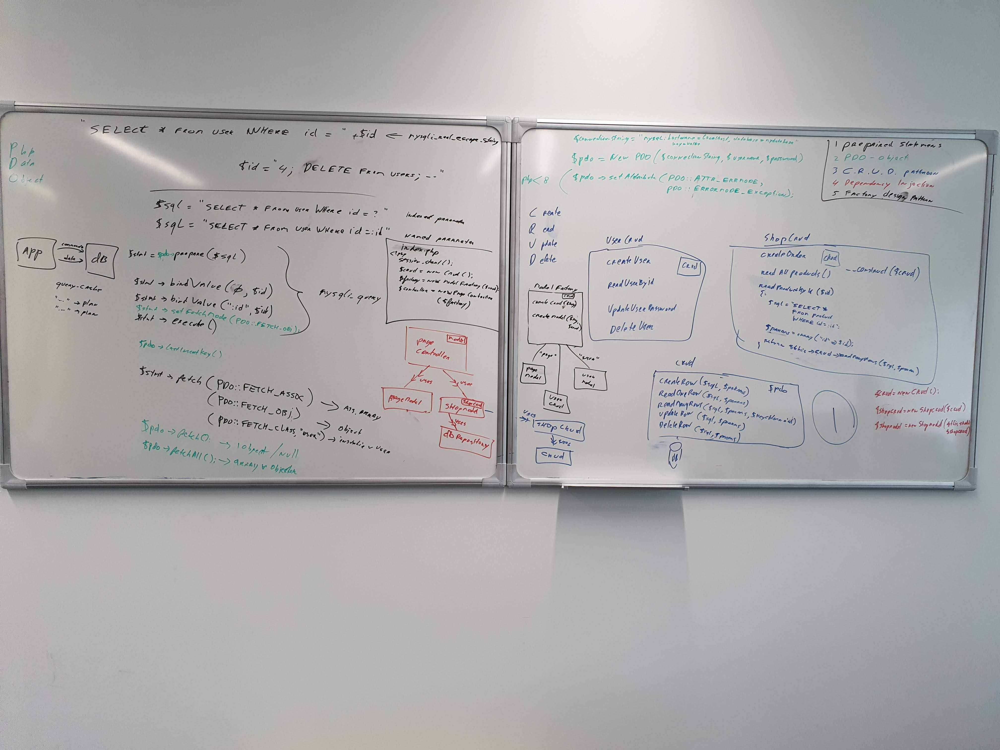

# Using OOP for a Webshop

## Module 
This module is a follow-up to the 'webshop database' and we will first convert the way we generate HTML into objects. Then we will convert the webshop into objects according to the Model-View-Controller (MVC) principle and finally we will adjust our data layer to use the C.R.U.D pattern and other Design Patterns.
 
 

## Learning
### MVC
The Model View Controller (MVC) design pattern specifies that an application consist of a data model, presentation information, and control information. The pattern requires that each of these be seperated into different objects. MVC is more of an architectural pattern, but not for complete application.

* The Model contains only the pure application data, it contains no logic describing how to present the data to a user.
* The View presents the model’s data to the user. The view knows how to access the model’s data, but it does not know what this data means or what the user can do to manipulate it. View just represent, displays the application’s data on screen. View page are generally in the format of .html.
* The Controller exists between the view and the model. It is where the actual business logic is written. It listens to events triggered by the view (or another external source) and executes the appropriate reaction to these events. In most cases, the reaction is to call a method on the model. Since the view and the model are connected through a notification mechanism, the result of this action is then automatically reflected in the view.

### CRUD
CRUD stands for: Create, Read, Update and Delete. CRUD represents four basic actions to interact with a database. The four actions here map directly to SQL's four core commands: INSERT, SELECT, UPDATE and DELETE.

### Dependency Injection
Dependency injection is a programming technique in which an object or function receives other objects or functions that it requires, as opposed to creating them internally. Dependency injection aims to seperate the concerns of constructing objects and using them, leading to loosely coupled programs. The pattern ensures that an object or function which wants to use a given service should not have to know how to construct those services. Instead, the receiving object or function is provided with its dependencies by an external code ('injector'). 

### Factory Method
The Factory Method design pattern is a creational design pattern that provides an interface for creating an object in the superclass but allows subclasses to alter the type of object that will be created. The Factory Method can be called as a tool to implement Dependency Injection.

